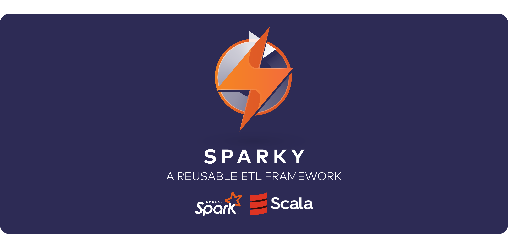
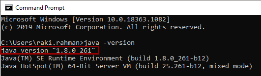
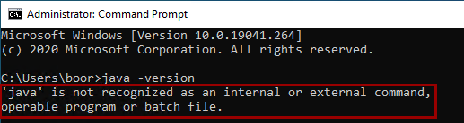
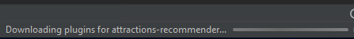
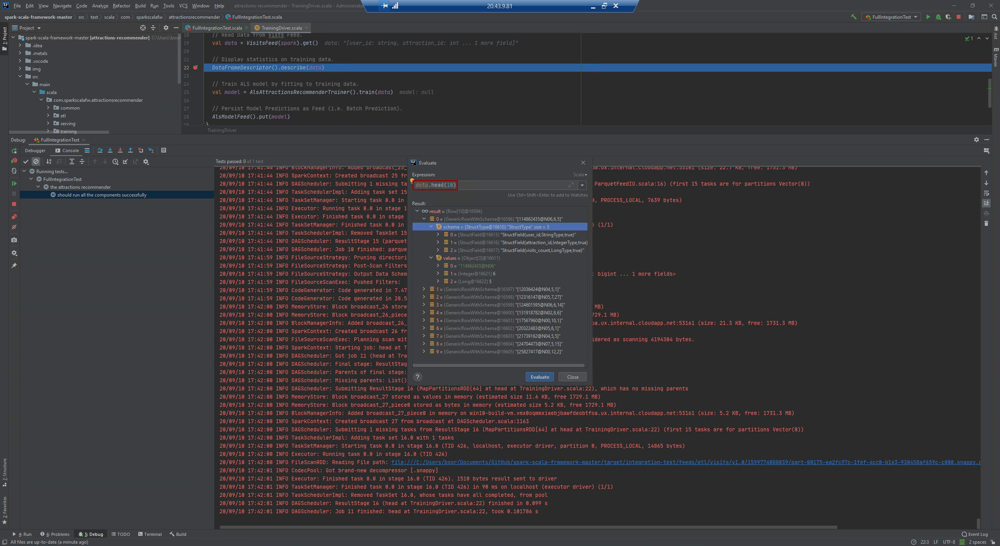

# `Sparky`: A reusable ETL Framework (demonstrated on **[Sigir17](https://sites.google.com/site/limkwanhui/datacode)** Dataset)
<div style="text-align:left"></div><br>

## Overview
This repository presents an organized approach at creating a complete ***"Software Product"*-style Reusable ETL Framework** on top of the Prototype/R&D *Non-Reusable Pipeline* demonstrated in [this example notebook](non-reusable-ETL-example.ipynb).<br>

A visual representation of how this is achieved:<br><br>
<br>

## Detailed Repository Structure
----------
```console
│   pom.xml                                                                    <- Contains configurations (dependencies, build/source/test, plugins etc.) for maven build.
│   README.md                                                                  <- The top-level README for developers using this project.
└───src                                                                        <- Contains all of the source material for building the project.
    ├───main                                                                   <- Artifact producing source directory for ETL Framework.
    │   └───scala                                                              <- Subdirectory for package hierarchy.
    │       └───com                                                            <- ... 
    │           └───sparky                                                     <- ...
    │               └───attractionsrecommender                                 <- ... 
    │                   │   FileSystemDriver.scala                             <- A top level driver that runs the entire pipeline components per driver, achieving decoupling via our feeds framework.
    │                   │   InMemoryDriver.scala                               <- A top level driver that runs the entire pipeline entirely on Spark Memory without drivers or feeds - and hence being coupled.
    │                   │
    │                   ├───common                                             <- Contains common definitions and utilities shared by many components.
    │                   │   ├───config                                         <- Subdirectory for holding configuration files.
    │                   │   │       EnvironmentConfiguration.scala             <- Utility object holding the environment configuration for the whole system, including environment variables at runtime.
    │                   │   │
    │                   │   ├───debug                                          <- Subdirectory for holding debugging modules.
    │                   │   │       DataFrameDescriptor.scala                  <- Modular data descriptor class to toggle verbose debugging on datasets, to be used on non-PROD pipelines.
    │                   │   │
    │                   │   ├───feeds                                          <- An abstraction to put data updates in a given path and get an update from path, useful for large, intermediate datasets.
    │                   │   │   │   Feed.scala                                 <- Defines detailed behavior of a Feed, while delegating IO operations to a specific FeedIO object.
    │                   │   │   │
    │                   │   │   ├───alsmodel                                   <- Feed for Spark ML's Alternating Least Squares Model.
    │                   │   │   │       AlsModelFeed.scala                     <- Extends the FeedIO class to support Spark ALS Model specific reads & writes.
    │                   │   │   │
    │                   │   │   ├───attractions                                <- POI Dataset.
    │                   │   │   │       AttractionsColumnNames.scala           <- Feed Specific Schema.
    │                   │   │   │       AttractionsFeed.scala                  <- Returns DataFrame object from CSV.
    │                   │   │   │
    │                   │   │   ├───io                                         <- Subdirectory for holding all Feed Input/Output related modules.
    │                   │   │   │       CsvFeedIO.scala                        <- Encapsulates CSV specific Feed related method definitions, with specific Spark syntax.
    │                   │   │   │       FeedIO.scala                           <- Encapsulates high-level Feed related methods and field definitions, in particular read and write.
    │                   │   │   │       ParquetFeedIO.scala                    <- Encapsulates Parquet specific Feed related method definitions, with specific Spark syntax.
    │                   │   │   │
    │                   │   │   └───visits                                     <- User Visits Dataset.
    │                   │   │           VisitsColumnNames.scala                <- Feed Specific Schema.
    │                   │   │           VisitsFeed.scala                       <- Returns DataFrame object from Parquet.
    │                   │   │
    │                   │   └───spark                                          <- Contains all Spark Session/Context related artifacts.
    │                   │           SparkSessionManager.scala                  <- Utility for managing the provisioning of a Spark session. Supports both local and distributed (i.e. Databricks, Synapse).
    │                   │
    │                   ├───etl                                                <- Contains ETL components used to perform operations on data.
    │                   │   │   EtlDriver.scala                                <- Driver for ETL Pipeline, contains high-level driver logic for initializing feeds from raw storage.
    │                   │   │
    │                   │   ├───attractions                                    <- Subdirectory for holding dataset specific modules.
    │                   │   │   │   AttractionsLoader.scala                    <- Trait definition for encapsulating method and field definitions for loading and transforming Attractions data.
    │                   │   │   │
    │                   │   │   └───sigir                                      <- Subdirectory for holding underlying source specific modules.
    │                   │   │           SigirAttractionsLoader.scala           <- Dataset specific logic that may be counter-intuitive to further modularize, such as specific column-level transformations.
    │                   │   │
    │                   │   └───visits                                         <- Subdirectory for holding dataset specific modules.
    │                   │       │   VisitsLoader.scala                         <- Trait definition for encapsulating method and field definitions for loading and transforming Visits data.
    │                   │       │
    │                   │       └───sigir                                      <- Subdirectory for holding underlying source specific modules.
    │                   │               SigirVisitsLoader.scala                <- Dataset specific logic that may be counter-intuitive to further modularize, such as specific column-level transformations.
    │                   │
    │                   ├───serving                                            <- Loads trained model and exposes a recommendations service. Supports different recommenders to coexist for A/B testing etc.
    │                   │   │   ServingDriver.scala                            <- Implementation of a A/B model serving pipeline driver that takes a list of users as the input for predictions.
    │                   │   │
    │                   │   └───recommender                                    <- Subdirectory for holding user recommendation model specific modules.
    │                   │       │   AttractionsRecommender.scala               <- Trait definition for encapsulating method and field definitions for serving the user recommendation model.
    │                   │       │
    │                   │       ├───mapping                                    <- Subdirectory for holding underlying map based (static) recommender modules.
    │                   │       │       MappingAttractionsRecommender.scala    <- A simple static recommender that receives and produces a static mapping from users to recommendations for serving.
    │                   │       │
    │                   │       ├───paneling                                   <- Subdirectory for holding underlying panel based (dynamic) recommender modules.
    │                   │       │       PaneledAttractionsRecommender.scala    <- Recommender Service that allows for multiple renditions in one single service - great for A/B testing between models.
    │                   │       │
    │                   │       └───spark                                      <- Subdirectory for holding Spark specific Model Prediction Pipelines.
    │                   │               AlsAttractionsRecommender.scala        <- Passes Spark ALS model a DataFrame containing each record we need predictions performed on.
    │                   │
    │                   └───training                                           <- Subdirectory for holding Model Training Pipelines.
    │                       │   EtlAndTrainingDriver.scala                     <- Driver for Model training pipeline that reads directly from raw source, performs transformations and trains model.
    │                       │   TrainingDriver.scala                           <- Driver for Model training pipeline that reads from feed, and trains model.
    │                       │
    │                       └───spark                                          <- Subdirectory for holding Spark specific Model Training Pipelines.
    │                               AlsAttractionsRecommenderTrainer.scala     <- Spark ALS Model Training and Tuning logic.
    │
    └───test                                                                   <- Artifact producing source directory for Testing Framework.
        ├───data                                                               <- Subdirectory for integration testing with data (can be pointer to ADLS instead).
        │   └───sigir17                                                        <- Subdirectory for data sources.
        │       ├───poiList-sigir17                                            <- This Master dataset comprises various attractions/points-of-interest (POI) that are found in each of the 5 theme parks.
        │       │       POI-caliAdv.csv                                        <- California Adventure POIs.
        │       │       POI-disHolly.csv                                       <- Disney Hollywood POIs.
        │       │       POI-disland.csv                                        <- Disneyland POIs.
        │       │       POI-epcot.csv                                          <- Epcot POIs.
        │       │       POI-MagicK.csv                                         <- Magic Kindgom POIs.
        │       │       README.txt                                             <- Dataset Information.
        │       │
        │       └───userVisits-sigir17                                         <- This Transactional dataset comprises a set of users and their visits to various attractions in 5 theme parks.
        │               README.txt                                             <- Dataset Information.
        │               userVisits-disHolly-allPOI.csv                         <- Disney Hollywood User Visit Records.
        │
        └───scala                                                              <- Subdirectory for package hierarchy.
            └───com                                                            <- ...
                └───sparky                                                     <- ...
                    └───attractionsrecommender                                 <- ...
                            FullIntegrationTest.scala                          <- Integration & unit testing pipeline via ScalaTest that performs automated tests by enforcing environment configurations.
```
----------
## Feature Description
### Packaging up this framework - JAR Compilation via Maven
Use `mvn install` for creating a [Fat JAR with Maven](http://tutorials.jenkov.com/maven/maven-build-fat-jar.html) containing all the dependencies compiled. This allows the components developed within this framework **callable** in the Cloud (say [Databricks](https://databricks.com/blog/2015/07/28/using-3rd-party-libraries-in-databricks-apache-spark-packages-and-maven-libraries.html)), by importing the JAR and calling it inside an ETL Pipeline. <br>

Alternatively, we could also deploy our ETL jobs to our Spark Clusters as part of a CICD Pipeline, which references and leverages this framework. <br>

In case we don't want to include the Spark dependencies in our JAR (as Spark dependencies can/will be managed on the Databricks Clusters as a seperate CICD pipeline), we can simply change the scope of the Spark dependency `spark.scope` in [pom.xml](pom.xml) from `compile` to `provided`, like so: <br><br>
<br>

This framework is structured such that setting this variable will override whether or not Spark libraries are managed from the repo (`compile`) or at cluster runtime (`provided`)

### Pipeline Structure

<br><br>

The *Pipeline* is split into four independent, reusable components:<br>
1. **common -** *Configurations*, *Feeds* management, *Debugging* and *Spark Session* management are each isolated in this package, on which all the components depend.
2. **etl -** reads the **raw or bronze** data, transforms it and loads it into the feeds that will then be consumed by other components. Currently loads `visits` and `attractions` from Sigir dataset, but can be easily cloned and expanded.
3. **serving -** loads the trained model and exposes a recommendations service. Supports different recommenders to coexist.
4. **training -** reads the `visits` feed and trains the ALS model. Currently we are demo-ing the Pipeline using Spark's [Alternating Least Squares](http://spark.apache.org/docs/latest/api/python/pyspark.ml.html#pyspark.ml.recommendation.ALS) algorithm, though this can be easily expanded to any library by leveraging the presented structure.

### Configuration

Some aspects of the different components are driven by **configurations**, which are managed in the common package. The values to be used for these configurable aspects should be set as environment variables when running each component, allowing them to be specific to different run environments.

### Feeds

<br><br>

The common package contains a simple framework for handling feeds, to which the components should delegate their IO.

These feeds are stored in a file system, in a root path that should be provided via configurations. By using this feed framework, different components can run completely independently and easily synchronize using a file system acting as a "whiteboard".

This can include DBFS local file system and mounted storage (e.g. ADLS) to be supported seamlessly - e.g. once the ADLS Filesystem is mounted on a Databricks Workspace, it can be accessed via `/mnt/`. Also, the feeds framework handles the versioning of the different updates in a feed using update timestamps in a transparent way, enhancing the auditability of the system. Of course, leveraging `Delta` would achieve the same purpose, although this is an enhancement we can build into this repository quite easily (currently includes classes for `CSV` and `Parquet` Feeds):<br><br>

### Drivers

<br><br>

A Driver is essentially a top-level program that triggers each component in sequence, allowing for **controlled execution**, **unit testing** and **debugging**. <br>

The idea behind a driver is, each independent component of the pipeline (**etl**, **serving**, **training**) are mutually exclusive (when leveraging feeds). This also allows us to mix-and-match components, in order to produce Drivers that represent a complete ETL job.

A few driver apps are included for the different components with this repository. Even though these should be helpful (especially the component-specific drivers that use feeds for synchronizing with other components), one could also compose the units in the code in any way needed.

### Debugging

The common package contains a DataFrame descriptor utility that is only initiated - by design - when `debug` is configured to be enabled:<br>
<br>

This is *extremely useful*, because:
- We want to use the same code in `DEV`, `TEST` & `PROD` without commenting out lines for verbose logging
- When in `DEV` & `TEST`, we often use smaller datasets and like to use verbose logging for debugging.
- When in `PROD`, we don't want to `display` datasets because:
    - The data may be PII (i.e. `display` would visualize the dataset at runtime)
    - Performing `display` or `describe` on a large dataset can be an extremely expensive **Action** that slows down our Pipeline (with no value add).

This descriptor prints basic stats about the data, and can be extended for any specific cases.

An IDE is also a great tool for debugging, and the way in which the components are organized makes it easy to do interactive debugging of each piece in isolation. <br><br>

### Paneled Recommender

In order to support different recommenders to coexist in the recommendations service, we provide a *paneled* implementation of the recommender that can use different implementations for different panels. This can be used for doing **A/B testing**.

When a recommendation request comes, the paneled recommender applies a deterministic hashing function on some characteristics of the requests and uses that hash to pick the panel to which the request belongs. <br>

A few things to note:
- It is important that we can re-create the hashing function used when analyzing recommendation logs to attribute behavior to the right implementation.
- The natural pick in this case would be to hash the user id in the request. Even though that's valid and useful, it is recommended to consider adding some "salt" to that so as to not always include the same users as exposed in our experiments. In this case we are using the `minute-of-the-hour` at the time of the request. Of course, we must be able to re-create our salting when re-creating the hashing function for analysis.

<br><br><br><br><br>

# How to use this framework - detailed steps
 Detailed steps that was followed to set this up on a fresh Windows 10 VM from scratch.

## Pre-requisites
----------
### Java 1.8
Ensure you have Java version 1.8 installed. To check this, open Command Prompt, and type:
```console
java -version
```
You should see:<br>
<br>

If instead, you see this:<br>
<br>

That means you don't have **Java Development Kit (JDK)** installed. To install it, click [here](https://www.oracle.com/java/technologies/javase/javase-jdk8-downloads.html), and install the suitable one for your OS version.

After installing, you should see the correct version "1.8.X_XXX", as well as **JDK** & **JRE** binaries populated here:<br>
<br>

### winutils

WinUtils is required as we'll be leveraging Spark locally to persist files to our local filesystem. <br>

Download **winutils.exe** from [here](https://github.com/cdarlint/winutils/tree/master/hadoop-3.2.1/bin):<br>
<br>

Then, follow these steps to add it in as an **Environment Variable**:<br>
<br>

* Navigate to **C** drive, create a new folder **hadoop*
* Create a new **bin** folder inside
* Paste **winutils.exe** into **C:\hadoop\bin**
* From **Start Menu**, search **Environment Variables** and click the search result
* Click **Environment Variables**
* Under **User variables for <user>**, click **New..**
* Enter **Variable name: `HADOOP_HOME`** and  **Variable value: `C:\hadoop`**
* Click **OK**
* Under **System variables**, click **Path**, then click **Edit..**. Click **New**
* Enter **`%HADOOP_HOME%\bin`**
* Click **OK**, and **OK** again

### IntelliJ IDEA

We will be using **IntelliJ Community Edition** for it's awesome Scala development capabilities. If you don't have it, you can install a free version from their [website](https://www.jetbrains.com/idea/download/#section=windows):<br><br>
<br>

Highly recommended - go ahead and install it with default settings. <br>

Open IntelliJ for the first time, and when prompted, click **Install** on Scala: <br>
<br>

### Clone/download this repo

Store the folder somewhere locally.

### Project Setup
----------
Open the Repo's Root folder with IntelliJ: <br>
<br>

If you get a popup from Windows Defender, click Allow - this is so that IntelliJ can connect to the internet and download dependencies etc.<br>

Once all of the background activities/scans/downloads below finish:<br>
<br>

You should see this view in the Project window:<br>
<br>

Expand `src > test > scala > ... > attractionsrecommender` and double click `FullIntegrationTest.scala`:
<br>

We will need to use the pop up buttons above to **Setup JDK** and **Setup Scala SDK**.

Click **Setup JDK**, and you should see Java 1.8 get picked up from your system - click that:<br>
<br>

You should see JDK 1.8 get added to your `External Libraries`, and the pop up should disappear:<br>
<br>

Next, click **Setup Scala SDK**, and click **Create > Download > 2.12.11**:<br>
<br>

We need to mark our **Test Sources Root** Directory and **Sources Root** - as such:

> Test Sources Root: `src > test > scala`<br>
> Sources Root: `src > main > scala`

To do this: **Right-Click on each folder > Mark Direcotry as > Test Sources Root/Sources Rooot**:<br>
<br>

Now, we want to set up our Unit Test configuration, by performing the following steps:<br>
<br>
* Click **Add Configuration..** on the top right-hand corner
* Click the **+** icon
* Select **ScalaTest**
* Name the Configuration to **FullIntegrationTest** (or whatever you like)
* In the **Test Class**, search for **FullIntegrationTest** and click the search result
* Click OK

We are now ready to run our end-to-end pipeline, and perform Unit Testing on it.

### Run Automation Test and results
----------
#### End-to-end run
To run the pipeline end-to-end as part of the **FullIntegrationTest** Driver, click run:<br>
<br>

We see:<br>
<br>

* An initial Build takes place
* A debug window pop up
* The Pipeline gets invoked end-to-end (don't be scared by the reds, they're JVM logs)
* The test case succeeds, and the unit test pipeline run ends

**Some highlights**:

We see output in white where our DataFrame is displayed as part of the debug pipeline:<br>
<br>

We also see our describe statements in action - showing the statistical distribution of our data:<br>
<br>

We see our Model Serving results in action:<br>
<br>

And finally, the datasets that get generated as part of the unit test is available on a timestamped folder:<br>
<br>

#### Debug mode
The framework also allows us to insert breakpoints in our pipeline, and run evaluation statements against the breakpoint (including accessing values of Spark DataFrames). <br>

To demonstrate, we insert a breakpoint before the `describe` in **`TrainingDriver.scala`**, and click Debug to run our debug pipeline once more:<br>
<br>

We note that the code halts at the step where it hits the break point:<br>
<br>

We can now type in the pop-up window to pass in statements into the debugger, to gain additional insights:<br>
**`data.show()`**:<br>
<br>

**`data.head(10)`**:<br>
<br>

We note that we can see the schema in detail here as well. <br>

**`data.count()`**:<br>
<br>

And we can continue the code from here, after our interim commands are done executing as well.